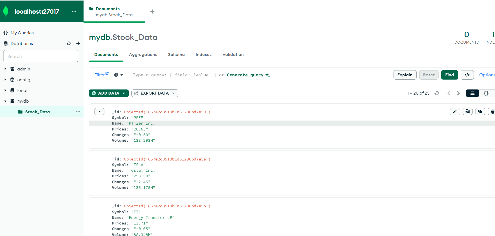

# Web Scraping Stock Data Project
Overview
This project is a web scraping application that extracts stock data from [Yahoo Finance - Most Active Stocks](https://finance.yahoo.com/most-active?guccounter=2). The scraped data includes stock symbols, names, prices, changes, and volumes. The data is then stored in a MongoDB database and displayed on a web page using PHP and HTML.

## Technologies Used
- Python: Used for web scraping the stock data from the Yahoo Finance website.
- MongoDB: A NoSQL database used to store the scraped stock data.
- XAMPP: Used to set up an Apache server for running the PHP and HTML files.
- Composer: Used to manage PHP dependencies.

## Python Web Scraping Summary
The Python script utilizes BeautifulSoup and requests to perform web scraping of stock data from Yahoo Finance's most active stocks page. The script iterates five times, fetching stock symbols, names, prices, changes, and volumes. It establishes a connection to a MongoDB database using the PyMongo driver, creating the "mydb" database if it doesn't exist. Within "mydb," it selects or creates a collection named "Stock_Data." The extracted stock information is then formatted into dictionaries, and each dictionary, representing a stock, is inserted into the "Stock_Data" collection in MongoDB using `insert_one()`. The script introduces a 3-minute delay between iterations, allowing for periodic updates to the financial data stored in the database. Adjustments can be made to the scraping frequency or other parameters based on specific project requirements.
## PHP Web Displaying Summary
The PHP file combines PHP and HTML to create a dynamic web page that fetches stock data from a MongoDB database and presents it in an HTML table. The PHP section establishes a connection to MongoDB, queries for stock information, and converts the result into an array for iteration. The HTML portion constructs a table with headers for Symbol, Name, Price, Change, and Volume. JavaScript is incorporated to enable table sorting by column headers. The resultant web page offers an interactive display of stock data, allowing users to easily explore and analyze the information in a tabular format with sortable columns. The styling enhances the visual presentation, making it suitable for financial data analysis.
## How to Run
- Install Python, MongoDB, XAMPP, and Composer.
- Run XAMPP and start the Apache server.
- Run the Python script to scrape and store stock data in the MongoDB 
- Place the PHP file in the appropriate directory accessible by the Apache server.
- Access the PHP file through a web browser with localhost/foldername of where your PHP script is located

## MongoDB Image

## Apache Server

